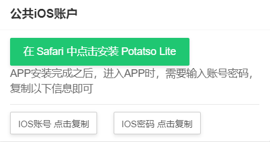
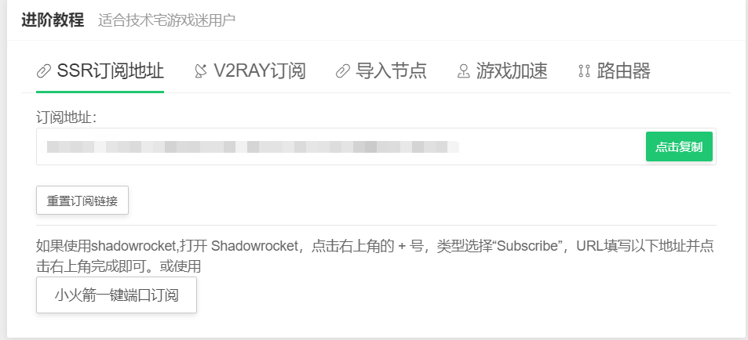
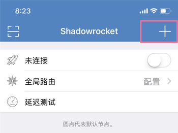
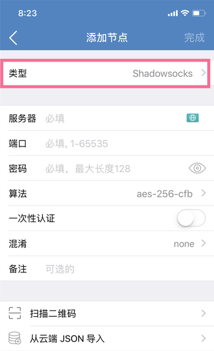
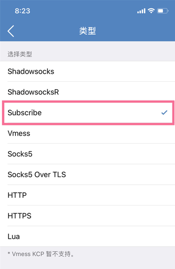
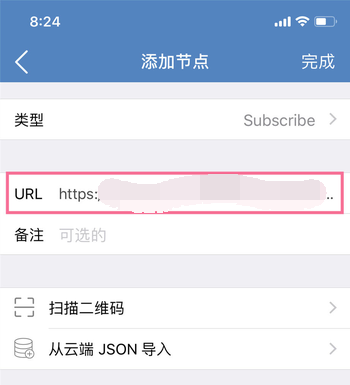
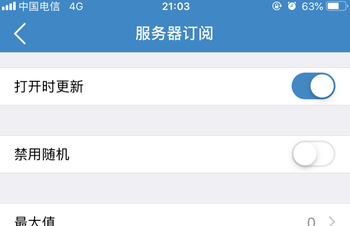

# iOS使用Shadowrocket接入节点

## 下载Shadowrocket

1.用户中心首页获取公共美区ID 并登入苹果商店App Store，下载安装Shadowrocket。


国区没有这个APP，必须切换美区。（注意：国区有很多类似名字的盗版软件，小心下错！


## 添加\(导入\)节点信息

### **打开首页用户中心 -&gt; 查看节点订阅**

1.在SSR菜单中点击复制订阅地址，稍后添加节点时需要用到。

2.添加订阅地址

`第一步`

`第二步`

`第三步`

`第四步`

## 启动代理

## 开启自动更新订阅


现在您可以享受咖啡猫加速网络体验。


