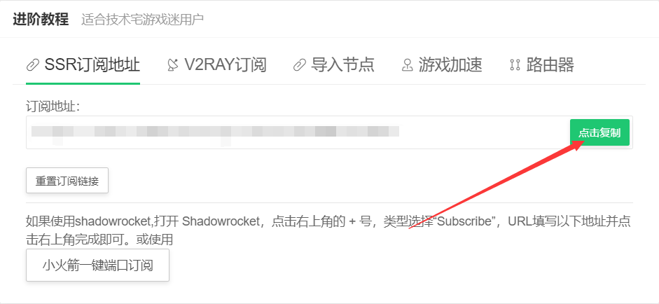
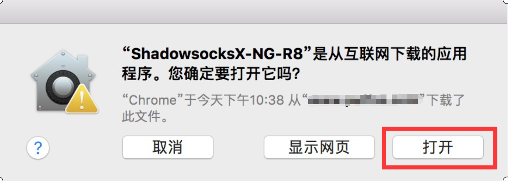

# MacOS使用ShadowsocksX-NG-R8接入节点

## 下载ShadowsocksX-NG-R8客户端

### **打开泡芙云用户中心 -&gt; 查看节点订阅**

1.在软件下载菜单中点击下载SSR-MacOS客户端并解压。

或[\[点击\]](https://caffecat.online/ssr-download/ssr-mac.dmg)下载

2.在SSR菜单中点击复制订阅地址，稍后添加节点时需要用到。


订阅地址包含节点的重要信息，请勿将订阅地址分享给他人。


## 添加\(导入\)节点信息

1.打开ShadowsocksX-NG-R8客户端，如果是第一次使用会弹出下图提示，请点击「打开」。

2.点击上方纸飞机图标，在「服务器」选项中点击「编辑订阅」。

3.点击左下角「 + 」添加订阅，把刚刚复制的订阅地址粘贴到「订阅地址」中，然后点击「OK」。

4.再次点击纸飞机图标，在「服务器」选项中点击「手动更新订阅」。

5.一小段时间后（具体时间取决于您的网络环境），您将会收到「服务器订阅更新成功」的通知消息，同时查看服务器列表也可以看到对应的节点。


使用订阅地址批量添加节点是推荐的方式，您也可以在节点列表中查看单个节点配置信息手动添加节点信息。


## 代理规则配置

点击纸飞机图标，在菜单中勾选「全局模式」，然后点击「打开 Shadowsocks」启动代理。（此为推荐设置，具体可按个人需求自行调整）


现在您可以享受咖啡猫加速网络体验。


