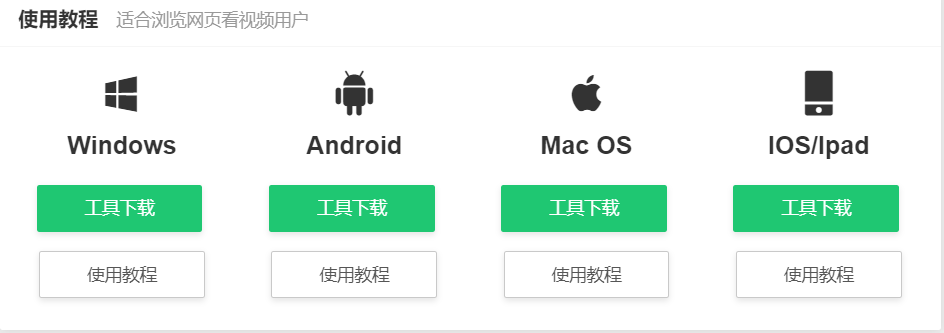
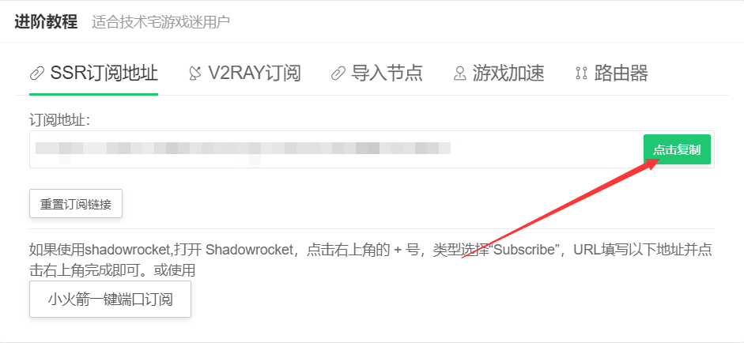
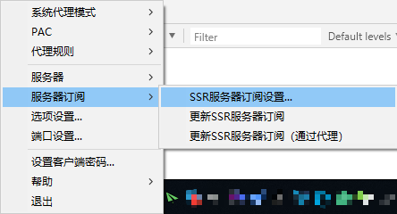
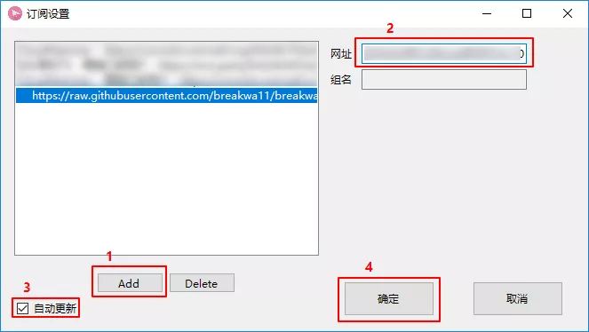
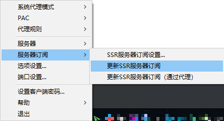
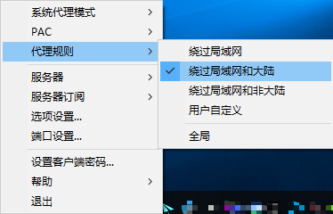

# Windows使用SSR接入节点

## 下载SSR客户端

### **打开咖啡猫加速用户中心**

1.在软件下载菜单中点击下载SSR-Windows客户端并解压。

2.在SSR菜单中点击复制订阅地址，稍后添加节点时需要用到。


订阅地址包含节点的重要信息，请勿将订阅地址分享给他人。


## 添加\(导入\)节点信息

1.打开 ShadowsocksR 客户端，然后右键点击托盘栏的纸飞机图标，在「服务器」选项中选择「SSR 服务器订阅设置」

2.在弹出的窗口中，点击 Add 按钮，在右侧的输入框中粘贴节点订阅地址，然后勾选「自动更新」复选框，点击「确定」。

1. 再次右键点击托盘栏纸飞机图标，在「服务器」选项中选择「更新 SSR 服务器订阅」。

4. 一小段时间后（具体时间取决于您的网络环境），您将会收到「服务器订阅更新成功」的通知消息，同时查看服务器列表也可以看到对应的节点。


使用订阅地址批量添加节点是推荐的方式，您也可以在节点列表中查看单个节点配置信息手动添加节点信息。


## 代理规则配置

右键点击托盘栏纸飞机图标，在「代理规则」菜单中选择「绕过局域网和大陆」，在「系统代理模式」菜单中选择「全局」。（此为推荐设置，具体可按个人需求自行调整）


现在您可以享受咖啡猫加速网络体验。


